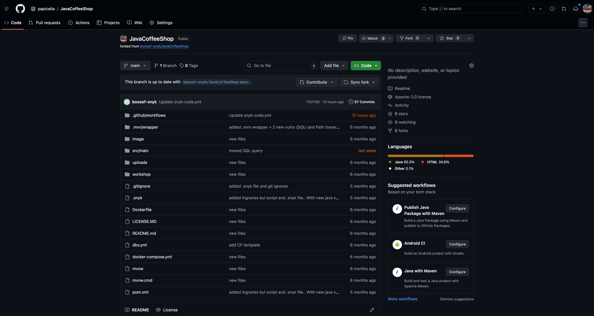
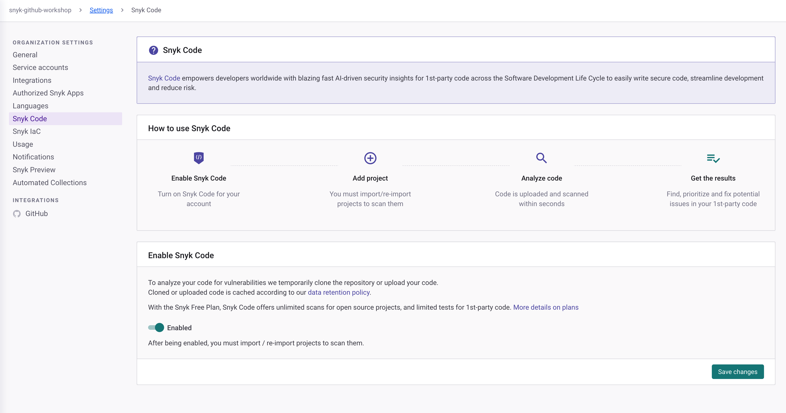

<h1 align="center">Snyk GitHub Workshop</h1>

The following workshop is designed to show how Snyk integrates into SCM systems like GitHub and performs various application security scans, what fix/remediation advice is given to secure your applications during different stages of the SDLC, and how you can access them via different interfaces like the web UI, IDE and CLI.

## Prerequisites

* Free GitHub account - https://www.github.com
* Free Snyk account  - https://app.snyk.io 
* [Visual Studio Code](https://code.visualstudio.com/download) connected to your GitHub account, and with the [Snyk Extension installed](https://github.com/snyk/vscode-extension?tab=readme-ov-file#install-the-extension)

## Agenda

We will cover the following topics, some live during today's session, and we'll let you explore the others on your own after the session.

  
Live - Hands-On Session

  
- [ ] Setting up the SCM integration between GitHub and Snyk
- [ ] Importing a repo into Snyk and scanning in via the SCM integration
- [ ] Opening a PR to fix a Snyk Open Source vulnerability
    

  
Live - Demo

  
- [ ] Detecting and suggesting fixes for transitive dependencies via the IDE
- [ ] [_Enterprise-only_] Fix Code issues in the IDE using DeepCode AI Fix
- [ ] Prioritization using Risk scores
- [ ] [_Enterprise-only_] Using `Reachability` as an additional parameter to determine risk
- [ ] [_Enterprise-only_] Reporting to provide visibility and facilitate collaboration between Security and Dev teams
- [ ] [_Enterprise-only_] Creating an inventory of code-based assets and setting up policies for security coverage
- [ ] [_Enterprise-only_] Run-time based risk factors to provide better risk assessment for prioritization
    

  
Offline

- [ ] Running Snyk in the IDE to detect and fix vulnerabilities  
- [ ] Set up the Snyk CLI
- [ ] Include Snyk scans in your CI/CD pipelines
- [ ] Integrate 3rd party tools like GitLeaks and TruffleHog using GitHub Actions to detect secrets
    

<h1 align="center">Hands-on Workshop Steps</h1>

_Note: It is assumed you're using a Mac for these steps, but it should also work on Windows or Linux with some minor modifications_

Step 1 - Fork our sample repo into your own GitHub account

#### Sign in to your GitHub account

* Navigate to the following GitHub repo - https://github.com/boosef-snyk/JavaCoffeeShop
* Click on the "**Fork**" button
* Check the "**Owner**" field on the next page to ensure you are forking this repo to your personal GitHub account
* Click done

 

Step 2 - Configure GitHub Integration

_NOTE: You may have already setup the GitHub integration on Snyk; in that case, go ahead and skip this step_

#### Login to https://app.snyk.io

* Sign up if you haven't already using your existing Google / GitHub / Bitbucket / Azure AD / Docker account
* Use the guided flow to set up the GitHub integration and grant Snyk access to all your public repos
* In Step 3 of the guided flow, you can select and import only the forked repo into Snyk 
* If you skipped the guided flow, navigate to Integrations -> Source Control -> GitHub

* Fill in your account credentials to connect your GitHub Account (if prompted).
* Now let's enable Code Scanning - you do that as follows:
  * Select Settings -> Snyk Code -> set "Enable Snyk Code" -> Save Changes
* Similarly, let's enable IaC Scanning - you do that as follows:
  * Select Settings -> Snyk IaC -> Enable "Detect Configuration files" -> Save Changes

 

Step 3 - Import JavaCoffeeShop Application

#### Optional

_You can skip this if you followed the guided flow in the previous step._

* Now that Snyk is connected to your GitHub Account, import the repo into Snyk as a Project.
* Navigate to Projects menu option
* Click "**Add Project**" then select "**GitHub**"
* Click on the repo you forked
* Once done (about 3 minutes), you should see something similar to this on the main projects page

* Let's go ahead and click on pom.xml
* Here you will see all vulnerabilities including a dependency tree of where the vulnerabilities exist

 

Step 4 - Create a Pull Request to trigger a PR check

#### Switch to your forked GitHub repo

* Create a new branch called `username`-snyk-test
* From the new branch, hit the `.` button to open up the GitHub Web Editor
* Modify the `pom.xml` and change the version of dependency X to Y
* Click on the Source Control extension and commit your changes and open a pull request to merge your changes to `main`
* Close the web editor and return to your repository, and open the PR you just created
* Scroll to the bottom and you will see the `code/snyk`, `security/snyk`, and `license/snyk` checks running - congratulations, your SCM integration is working as expected! 
* Once the tests complete running, you can click on the "**Details**" button next to them to view the scan report in the Snyk UI  

Step 5 - Find and fix issues in the IDE
 

#### Switch to Visual Studio Code now 

* Open the Command Palette in VS Code (Cmd + Shift + P on Mac) and type `Git: Clone`
* Click on "**Clone from GitHub**" and select the forked **JavaCoffeeShop** repo from the list of options (or search for it, if you don't see it)
* Click on the Snyk extension in the Extension Bar and click "**Connect VS Code with Snyk**"
* The scans should start running automatically, but if they don't, save your project or click the "**Rescan**" button in the Snyk extension panel
  * The first time you run the scans, they might take longer, because Snyk will need to download and set up the CLI in the background
* Under "**Open Source Security**," expand the results for your pom.xml and click on X
* You should see the following:
  * An editor window opens up the pom.xml with the yellow lightbulb icon next to the line where the vulnerability appears
  * A new tab with details of the vulnerability appears to the right of your editor
* Click on the yellow lightbulb icon, and a list of options appears
* Select the first option under "**Quick Fix**" - "xyz"
* Save your changes, and the scans should start running again automatically
* When the Open Source scan completes, you should see that there are now only X vulnerabilities, where there previously were Y - congratulations, you have found and fixed vulnerabilities right from your IDE!    

 

<h1 align="center">Congratulations - Workshop Completed!!!</h1>

Thanks for attending and completing the live portion of this workshop. :) 

## Offline Tasks

Now that you have an idea of how Snyk works, and you have the basic setup completed, you can continue learning about Snyk on your own by trying out the following:

  
Setting up the Snyk CLI

  
Including Snyk scans in your pipelines using GitHub Actions

  
Integrating 3rd party tools with GitHub Actions to detect secrets

  

    
GitLeaks

  

  

    
TruffleHog

  

## Resources

-

Shilpa Raghunathan [shilpa.raghunathan at snyk.io] is a Staff Partner Solutions Engineer at Snyk  
Pas Apicella [pas at snyk.io] is a Principal Solution Engineer APJ at Snyk
